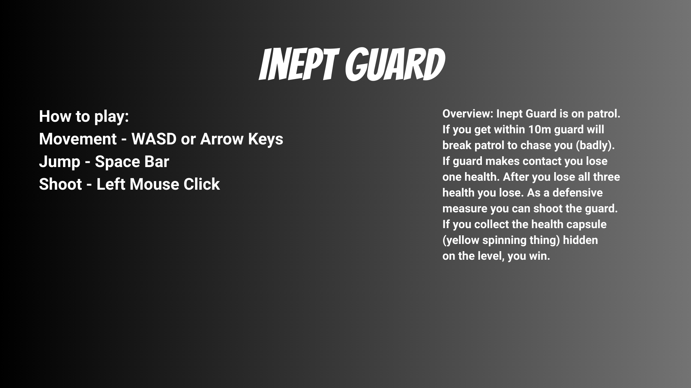

# Inept Guard

## 🎮 Overview
*Inept Guard* is a Unity project built while reading through Harrison Ferrone's Learning C# by Developing Games with Unity. Great book, by the way. Solid intro to both C# and Unity!
The player must outsmart an inept guard patrolling the level — if you get too close, the guard will clumsily chase you down. Survive, shoot, or find the hidden health capsule to claim victory!

## 🕹️ How to Play
- **Movement:** WASD or Arrow Keys  
- **Jump:** Space Bar  
- **Shoot:** Left Mouse Click  

## ⚔️ Gameplay
- The guard patrols until the player gets within **10m**, then breaks patrol to chase.  
- Contact with the guard = **lose one health** (3 total).  
- Shooting the guard knocks it back.  
- Find the **yellow spinning health capsule** hidden in the level to win.  

## 🛠️ Built With
- [Unity 2023.1](https://unity.com/)  
- C# (MonoBehaviour scripts)  

## 🚀 Play Online
You can try the WebGL build on **Unity Play** here:  
🎮 [Play Inept Guard](https://play.unity.com/en/games/0e45439f-3240-4a8d-abfd-faeb35e7153f/inept-guard) 
